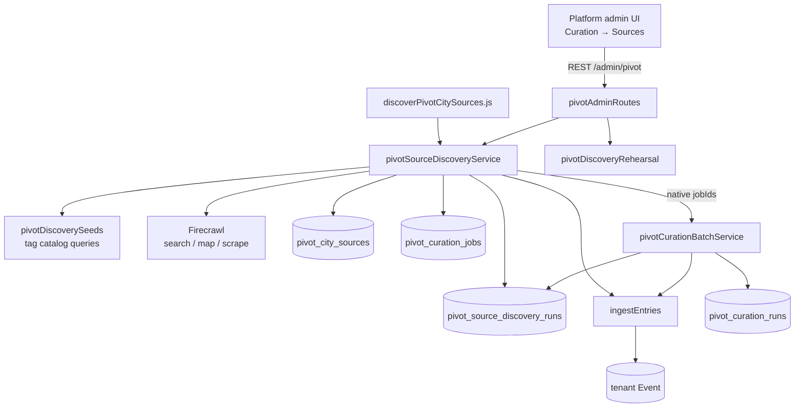
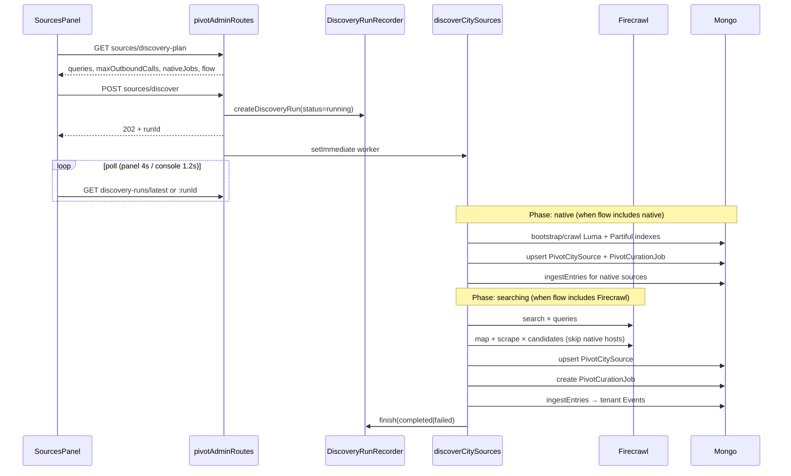
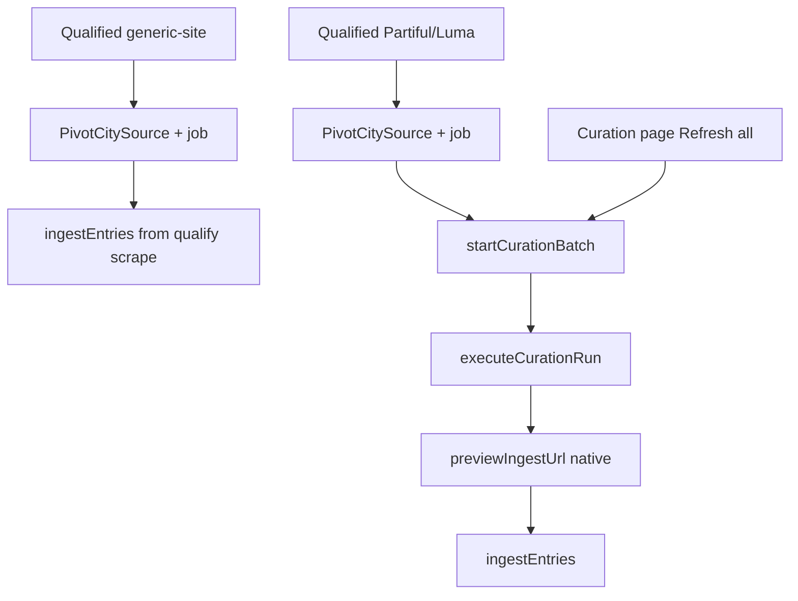
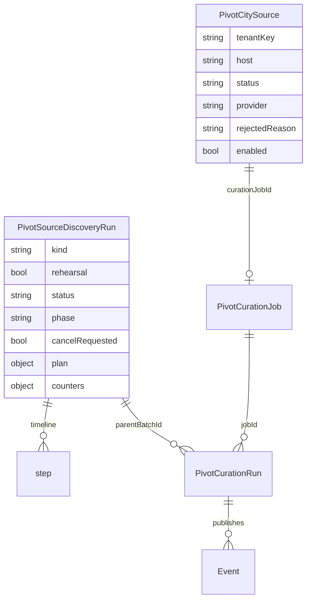
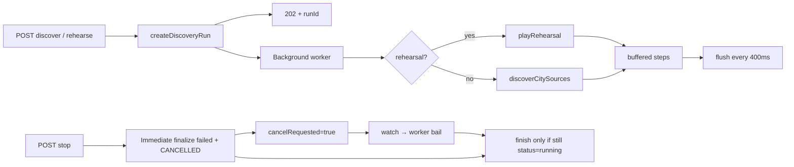

# Pivot / Just Go — city source discovery (temporary walkthrough)

> Temporary full-system notes. Safe to delete when you’re done.
> Product name **Just Go**; code name **Pivot**.  
> Deeper design notes: `backend/docs/just-go-agent-scrape-jobs-handoff.md`  
> Implementation plan: `../Meridian-Mintlify/strategy/pivot-native-first-discovery-plan.mdx`

---

## 1. What this system is for

Given only a Pivot tenant’s city (`tenantKey`), discovery:

1. Finds recurring event calendars (venues, organizers, alt-weeklies, campus calendars, …)
2. Proves each host actually yields dated events
3. Registers survivors in a **source registry**
4. Creates weekly **refresh jobs** (`generic-site` / Partiful / Luma)
5. **Ingests** the events already scraped during qualification (staged/draft — same human release gate as manual curation)

It replaces a manual CLI-agent loop. Scope is deliberately non-agentic: same tag-catalog seeds every run, findings persist, cost is bounded before start. Long-tail cities are not covered by Partiful/Luma alone; `generic-site` jobs need a URL — discovery chooses those URLs.

**Discovery ≠ weekly recrawl.** Discover finds and registers sources. Refresh / batch recrawls those saved jobs for the drop week. Native bootstrap still crawls Luma/Partiful *during* a discovery run (correct for a new city). That is the wrong loop for “update this week’s catalog” — use **Refresh all** on Saved jobs instead. Neither path is on a cron; drop-day push does not start discovery.

---

## 2. System context



| Layer | Path |
|-------|------|
| Pipeline | `backend/services/pivotSourceDiscoveryService.js` |
| Firecrawl | `backend/services/pivotSiteScrapeService.js` |
| Seeds | `backend/constants/pivotDiscoverySeeds.js` |
| Registry schema | `backend/schemas/pivotCitySource.js` |
| Run telemetry | `backend/schemas/pivotSourceDiscoveryRun.js` |
| Rehearsal | `backend/services/pivotDiscoveryRehearsal.js` |
| Recorder / stop | `backend/services/pivotDiscoveryRunRecorder.js` |
| Abort pools | `backend/services/pivotRunGuard.js` |
| Jobs | `backend/services/pivotCurationJobService.js` |
| Ingest / per-job runs | `backend/services/pivotCurationRunService.js` |
| Batch refresh | `backend/services/pivotCurationBatchService.js` |
| Routes | `backend/routes/pivotAdminRoutes.js` (mount `/admin/pivot`) |
| CLI | `backend/migrations/discoverPivotCitySources.js` |
| UI | `frontend/.../PivotTenantSourcesPanel.jsx`, `PivotDiscoveryConsole.jsx`, `PivotTenantCurationPage.jsx` |

---

## 3. End-to-end happy path



**Async contract:** API returns immediately; UI polls a narrated run document. There is no SSE. Closing the console does **not** stop the run.

---

## 4. Discovery plan (before any spend)

**Functions:** `buildCityDiscoveryPlan` → `previewCitySourceDiscovery` / `startCitySourceDiscovery`  
**Route:** `GET /admin/pivot/tenants/:tenantKey/sources/discovery-plan`  
**Seeds:** `buildDiscoveryQueries` in `pivotDiscoverySeeds.js` (from tag catalog — ~18 slugs)

### Inputs

| Option | Default | Role |
|--------|---------|------|
| `tenantKey` | required | City |
| `flow` | `native-then-firecrawl` | Discovery flow (see flows table above) |
| `lumaSlug` | tenant config | Luma city slug for `https://luma.com/{slug}` |
| `partifulSlug` | tenant config | Partiful city slug for `https://partiful.com/explore/{slug}` |
| `tags` | all catalog slugs | Filter queries; unknown-only → empty → `NO_DISCOVERY_QUERIES` (only when `runFirecrawl` true) |
| `maxQueries` | none | Cap after interleave |
| `maxCandidates` | `20` | Map+scrape budget |
| `minEvents` | `1` | Qualify threshold |
| `resultsPerQuery` | `8` | Search page size (live) |
| `createJobs` | `true` | Create refresh jobs for qualified hosts |
| `recheckRejected` | `false` | Re-evaluate previously rejected hosts |
| `ingestEvents` / `chainNativeJobs` | `true` | CLI can disable with `--no-ingest` |

### Query generation

1. **City-wide** templates first (`CITY_WIDE_QUERY_TEMPLATES` × city name)  
   e.g. `"Iowa City events calendar this week"`
2. Then **interleaved tag** templates (`TAG_QUERY_TEMPLATES`) so `maxQueries` trims depth, not whole categories  
   e.g. `"live music ${city}"`

City display / location / timezone come from the tenant (`name`, `location`, `pivotDropTimezone` via `resolvePivotTenant`).

### Cost ceiling

```
maxOutboundCalls = runFirecrawl ? (queries.length + maxCandidates * 2) : 0
```

- **Native-only flows:** `maxOutboundCalls: 0` (no Firecrawl calls)
- **Hybrid/Firecrawl flows:** one search per query + map + scrape per candidate upper bound
- **Native jobs:** Returned in plan as `nativeJobs` array with URLs from slugs and existing jobs

### Discovery flows and API key requirements

Discovery supports three flows, configured per tenant:

| Flow | Native Phase | Firecrawl Phase | FIRECRAWL_API_KEY Required | Use Case |
|------|--------------|-----------------|---------------------------|----------|
| `native-then-firecrawl` (default) | ✅ Bootstrap Luma/Partiful indexes first | ✅ Search + scrape long-tail venues | **Yes** | Large cities with native + venue coverage |
| `native-only` | ✅ Bootstrap Luma/Partiful indexes only | ❌ Skip Firecrawl entirely | **No** | Credit-sensitive cities or native-only coverage |
| `firecrawl-only` | ❌ Skip native bootstrap | ✅ Search + scrape all venues | **Yes** | Cities without Luma/Partiful presence |

**API key enforcement:** Without `FIRECRAWL_API_KEY`, flows requiring Firecrawl return `SITE_SCRAPE_NOT_CONFIGURED` (503) on real runs. Native-only flows and Rehearse work without the key.

---

## 5. Live pipeline stages

Worker: `startCitySourceDiscovery` → `createDiscoveryRun` → `scheduleCitySourceDiscovery` → `discoverCitySources`.

**Concurrency:** search `2`, qualify `4`  
**Map link limit:** `60`  
**Step flush / cancel poll:** `400ms`  
**Max steps on run doc:** `600`  
**Phases:** `native → searching → filtering → qualifying → registering → done`

```mermaid
flowchart LR
  Config[resolveDiscoveryConfig] --> Native{runNative?}
  Native -->|yes| Bootstrap[bootstrapNativeSources]
  Bootstrap --> NativeCrawl[crawl Luma/Partiful indexes]
  NativeCrawl --> NativeReg[persist + createCurationJob]
  NativeReg --> NativeIngest[ingestEntries from native]
  
  Native -->|no| Search[searchSites × queries]
  NativeIngest --> Firecrawl{runFirecrawl?}
  Firecrawl -->|yes| Search
  Firecrawl -->|no| Done[complete]
  
  Search --> Filter[skip known/non-source/SSRF + native hosts]
  Filter --> Qual{native host?}
  Qual -->|Partiful/Luma + no job| RegQ[persist qualified]
  Qual -->|generic-site| Map[mapSite]
  Map --> Pick[pickEventIndexUrl]
  Pick -->|none| Rej1[reject no-index-page]
  Pick -->|ok| Scrape[scrapeSiteEvents]
  Scrape -->|dated drafts ≥ minEvents| RegQ
  Scrape -->|else| Rej2[reject reason]
  RegQ --> Job[createCurationJob]
  Job --> Ing{have entries?}
  Ing -->|yes| Publish[ingestEntries]
  Ing -->|native, no entries| Chain[startCurationBatch]
  Publish --> Done
  Chain --> Done
```



### Stage A — native bootstrap (`phase: native`)

| | |
|---|---|
| Fn | `bootstrapNativeSources` → `crawlNativeJob` |
| When | `runNative === true` (all flows except `firecrawl-only`) |
| API | Native parsers in `pivotIngestPreviewService` (no Firecrawl) |
| Steps | `native` per provider |
| Sources | Luma: `https://luma.com/{lumaSlug}`, Partiful: `https://partiful.com/explore/{partifulSlug}` |
| Jobs | Create or reuse one job per provider; rewrite non-index URLs to city indexes |
| Outcome | Crawled `nativeJobIds` + `skipHosts` for Firecrawl filtering |

### Stage B — searching (`phase: searching`)

| | |
|---|---|
| When | `runFirecrawl === true` (skipped for `native-only`) |
| Fn | `collectCandidates` → `searchSites` |
| API | Firecrawl `POST /v2/search` |
| Steps | `plan`, `search` (+ `retry` on 429) |
| Writes | Run counters only (`searches`, `candidatesFound`) |
| Outcome | host → `{ host, url, title, seedTags, discoveredVia }` |

### Stage C — filtering (`phase: filtering`)

| | |
|---|---|
| Steps | `candidates`, then `filter` per skip |
| Skip if | non-source / blocked host / bad URL / already in registry (unless `recheckRejected` + was rejected) **+ native hosts when `skipNativeHostsInSearch`** |
| Native skip | **Result filtering, not fewer queries:** `luma.com`, `partiful.com`, `lu.ma` + any host with existing jobs are dropped from candidates |
| Sort | More `seedTags` first; slice to `maxCandidates` |
| Counters | `skippedKnown`, `skippedNonSource`, `skippedNative`, `evaluated` |
| Writes | None to registry |

**Important:** Skip-host behavior filters results, it does not reduce search query count. Firecrawl still searches the full query list; native hosts are dropped from the candidate list during filtering.

### Stage D — qualifying (`phase: qualifying`)

| | |
|---|---|
| Fn | `qualifyCandidate` via `runPool` (concurrency 4) |
| **Native** (Partiful/Luma) | Skip Firecrawl if no existing job; step `native`; `eventCount: 0`, no entries — batch will crawl later |
| **Generic** | `mapSite` → `pickEventIndexUrl` / `scoreEventIndexUrl` → step `index` → `scrapeSiteEvents` |
| Success | Dated drafts (`draft.start_time`) ≥ `minEvents` → step `qualify`, carry `entries` |
| Reject | `no-index-page`, `scrape-failed`, `no-events`, `below-threshold` |
| Abort whole run | Fatal Firecrawl codes or rate-limit streak ≥ 4 → step `abort` |

Index scoring favors paths like `events`, `calendar`; penalizes deep paths, dated paths, query strings.

**Note:** `firecrawl-only` flow can still native-qualify a Luma/Partiful search hit if no job exists yet, avoiding `generic-site` treatment of a host we can parse natively.

### Stage E — registering (`phase: registering`)

| | |
|---|---|
| Fn | `persistOutcome` → upsert `PivotCitySource` |
| Qualified | `createCurationJob` (`defaultBatchWeekStrategy: 'next-drop'`, `defaultTags: seedTags`) → `curationJobId`; step `job` |
| Native w/ job, no entries | Collect `nativeJobIds` for batch chain |

### Stage F — ingest

| | |
|---|---|
| Fn | `ingestEntries` (`pivotCurationRunService`) |
| When | Qualified + scraped `entries` + ingest not disabled |
| Steps | `ingest` |
| Data | Tenant `Event` upserted on `customFields.pivot.sourceUrl`; tags from `seedTags`; week from event start (fallback `next-drop`) |
| Status | Staged (untagged → draft); never feed-published without human release |
| Failure | Warn step; source still registered |

### Stage G — optional native batch

| | |
|---|---|
| Fn | `startCurationBatch({ jobIds: nativeJobIds, batchWeek })` |
| When | Native jobs exist but had no entries from bootstrap (typical for new jobs) |
| Kind | Separate run doc `kind: 'curation-batch'` (same collection) |
| Failure | Warn only; discovery can still `completed` |
| End | Step `done` |

---

## 6. Firecrawl / site scrape layer

**File:** `backend/services/pivotSiteScrapeService.js`

| Export | Endpoint | Notes |
|--------|----------|-------|
| `searchSites` | `/v2/search` | ~30s; metadata; `location` from tenant |
| `mapSite` | `/v2/map` | ~30s; `includeSubdomains: true`; optional search hint |
| `scrapeSiteEvents` | `/v2/scrape` | ~90s; `waitFor: 3000`; JSON + `SITE_EVENT_SCHEMA` + extraction prompt |
| Shared | `postWithRateLimitRetry` | up to 3 attempts; honors Retry-After |
| Ceiling | `MAX_SITE_EVENTS_CEILING = 250` | Slice on response |

Drafts built via `buildSiteEventDraft` / `resolveDraftSourceUrl` — same shape as Partiful/Luma (`source: 'generic-site'`, …). Stable `#slug-date` if no per-event URL.

**Rough credit model (handoff):** search ~1/query; map 1/host; scrape+JSON extract ~5/host.

---

## 7. Source registry

**Model:** `PivotCitySource` → `pivot_city_sources` (global DB)  
**Unique:** `{ tenantKey, host }` (`www.` stripped; subdomains distinct)

| Field | Notes |
|-------|--------|
| `url` | Best **event-index** URL, not homepage |
| `label` | From scrape `listLabel` or search title |
| `provider` | `partiful` \| `luma` \| `generic-site` |
| `status` | `qualified` \| `rejected` |
| `rejectedReason` | `no-events`, `below-threshold`, `scrape-failed`, `no-index-page`, `blocked-host` |
| `enabled` | Mute refresh without looking like a discovery failure |
| `seedTags` | Catalog slugs whose queries found the host |
| `discoveredVia` | Winning query string |
| `lastEventCount`, `lastQualifiedAt` | Yield history |
| `curationJobId` | Linked refresh job |

**Admin API:** `GET .../sources`, `PATCH .../sources/:sourceId` (Mute/Enable only)  
**UI:** Sources table on the Discovery agent strip / Sites section.

Persisted rejects come from qualify. Filter skips private/non-source hosts without writing a rejected row.

---

## 8. Jobs, ingest, and curation-batch



| Store | Role |
|-------|------|
| `pivot_curation_jobs` | Refresh jobs (`partiful` \| `luma` \| `manual-json` \| `generic-site`) |
| `pivot_curation_runs` | Per-job crawl history (`parentBatchId` when batched) |
| `pivot_source_discovery_runs` | Narration for `kind: discovery` **and** `kind: curation-batch` |
| Tenant `Event` | Catalog; `customFields.pivot.*` |

Discovery **finds** sources. Batch **refreshes** them. Initial generic-site events come from the **qualifying scrape**, not a second crawl. Native indexes are crawled during discovery bootstrap so a new city is not empty — after that, weekly recrawl is **Refresh all** (or per-job **Run for week**), which hits the same batch API with no Firecrawl search.

### Cadence

| Action | When | Entrypoint |
|--------|------|------------|
| **Discover** | New city, new venues, occasional gap-fill | UI **Discover** on the Discovery agent; `POST /admin/pivot/tenants/:tenantKey/sources/discover`; CLI `migrations/discoverPivotCitySources.js` |
| **Refresh / batch** | Weekly, before drop | UI **Refresh all** / **Run for week**; `POST .../curation-batches`; `POST .../curation-jobs/:jobId/run` |
| **Drop push** | At `resolvePivotDropInstant` | `npm run send:pivot-weekly-push` — nudge only; does **not** start discovery or a batch |

Nothing is scheduled. `pivotCrewWeekStateScheduler` rebuilds crew week state; it does not crawl. Do not auto-start Firecrawl discovery on drop day.

Batch orchestration: `BATCH_CONCURRENCY = 2`; phases `planning → crawling → done`; steps `job-start` / `job-done`.

---

## 9. Data model



**Run kinds:** `discovery` \| `curation-batch`  
**Statuses:** `running` \| `completed` \| `failed` (cancel → `failed` + `aborted.code: 'CANCELLED'`)  
**Discovery phases:** `native → searching → filtering → qualifying → registering → done`  
**Batch phases:** `planning → crawling → done`

**Step kinds:** `plan`, `search`, `candidates`, `filter`, `native`, `map`, `index`, `scrape`, `retry`, `qualify`, `reject`, `job`, `ingest`, `job-start`, `job-done`, `abort`, `done`  
**Tones:** `info` \| `good` \| `warn` \| `bad`

Telemetry rule: the pipeline does not read the run doc for control flow except via the **cancel watch**. Steps are narration for humans/UI.

---

## 10. Run orchestration (async + stop)



| Concern | Behavior |
|---------|----------|
| Start | Recorder created **before** worker so UI can poll immediately |
| Poll | Panel: latest **without** steps, 4s live / 30s idle. Console: by `runId` or latest+steps, ~1.2s |
| Stop | HTTP handler **finalizes immediately**; worker watch (400ms) aborts in-flight work |
| Finish race | `updateOne({ _id, status: 'running' }, …)` — cannot overwrite a stopped run |
| Rehearsal pace | `STEP_DELAY_MS = 1200` + interruptible ~200ms sleeps |

Closing the Watch console ≠ Stop. Stop swaps in for Discover on the agent strip while `latestRun.status === 'running'`.

---

## 11. Rehearsal

**File:** `pivotDiscoveryRehearsal.js` — separate module so it cannot become a live spend path.  
**Route:** `POST .../sources/rehearse` → 202

| Simulates | Skips |
|-----------|-------|
| Real city, real `buildDiscoveryQueries`, same phases/step kinds | All Firecrawl |
| Fixture hosts (qualify / native / filter / rejects) | Registry writes |
| Paced narration (~40s full run) | Jobs, events, credits |
| `rehearsal: true`, `maxOutboundCalls: 0` | |

Registering steps say “Would save a job…” — nothing persists.

---

## 12. Frontend surfaces

| Surface | Role |
|---------|------|
| **Curation page** | Hosts Sources panel above Saved jobs; **Refresh all** → curation-batches; shares console for batch Watch |
| **Discovery agent strip** | Discover / Rehearse / Stop / Watch · Configure (tags, caps, jobs, recheck) · Sites table Mute/Enable · plan cost preview. Copy states this is not the weekly recrawl. |
| **Discovery console** | Popup step timeline + orb; works for `discovery` and `curation-batch` |
| **Saved jobs** | Includes jobs discovery created; **Refresh all** recrawls them for the week; per-job **Run for week**; manual “Website (scraped)” = `generic-site` |

Discovered sources show up as registry rows + new jobs + staged catalog events — not a separate product page.

---

## 13. CLI

```bash
# from Meridian/backend
node migrations/discoverPivotCitySources.js --city="Iowa City" --plan
node migrations/discoverPivotCitySources.js --list-tenants
node migrations/discoverPivotCitySources.js --tenant=ic --flow=native-only --luma-slug=ic --plan
node migrations/discoverPivotCitySources.js --tenant=sf --flow=native-then-firecrawl --luma-slug=sf --partiful-slug=sf
npm run discover:pivot-city-sources -- --tenant=ic
```

Flags: `--plan`, `--flow`, `--luma-slug`, `--partiful-slug`, `--tags`, `--max-queries`, `--max-candidates`, `--min-events`, `--no-jobs`, `--no-ingest`, `--recheck-rejected`  
Calls `discoverCitySources` synchronously (no HTTP 202). Native-only flows skip Firecrawl key check.

---

## 14. Config checklist

| Need | When | Why |
|------|------|-----|
| `FIRECRAWL_API_KEY` | `native-then-firecrawl` and `firecrawl-only` flows | Search + map/scrape `generic-site` venues |
| Pivot tenant (`pivot` / `pivotPilot`) | Always | `tenantKey`, city `name`, `location`, `pivotDropTimezone` |
| Luma/Partiful slugs | Native flows | City discovery pages for native bootstrap |
| Platform admin auth | Always | UI/API access |
| Mongo global + tenant DBs | Always | Registry / runs / jobs global; Events per tenant |

**Without Firecrawl key:** `native-only` flows work normally; others return 503 on discover (Rehearse still works). CLI fails fast unless `--plan` or `--flow=native-only`.

---

## 15. API cheat sheet

| Method | Route | Result |
|--------|-------|--------|
| `GET` | `.../sources/discovery-plan` | Plan + cost + `flow` + `nativeJobs` + `nativeReady` + `configured` |
| `POST` | `.../sources/discover` | **202** `{ runId, plan }` → live worker (find sources, not weekly recrawl) |
| `POST` | `.../sources/rehearse` | **202** → paced fixture |
| `POST` | `.../discovery-runs/:runId/stop` | Immediate finalize + cancel |
| `GET` | `.../discovery-runs/:runId` | Full run + steps |
| `GET` | `.../discovery-runs/latest` | Latest; `?includeSteps=true` |
| `GET` / `PATCH` | `.../sources` (+ `/:sourceId`) | Registry list / Mute |
| `PATCH` | `.../sources/discovery-config` | Save flow/slugs as tenant default |
| `POST` | `.../curation-batches` | **202** weekly refresh of saved jobs |
| `POST` | `.../curation-jobs/:jobId/run` | Recrawl one job for the week |

---

## 16. How to exercise it

1. Open `/platform-admin/pivot/:tenantKey` (Curation) as platform admin.
2. **Configure** tags / caps / createJobs / recheckRejected; glance at plan cost.
3. **Rehearse** — no Firecrawl; watch the console timeline.
4. **Stop** mid-rehearse — panel should leave running immediately.
5. **Discover** (native-only needs no key; hybrid needs `FIRECRAWL_API_KEY`) — native bootstrap, then search → filter → map/scrape → qualify → job → ingest.
6. Confirm: registry row, Saved job, staged events in the catalog; native hosts may spin a curation-batch.
7. For a **weekly refresh**, do not Discover again. Expand Saved jobs → **Refresh all** (or **Run for week** on one job).

---

## One-liner

Discovery turns a city into a durable source registry + refresh jobs + staged events (native indexes first, then Firecrawl long tail). Weekly catalog updates recrawl those jobs via **Refresh all** — they are not another discovery run.
