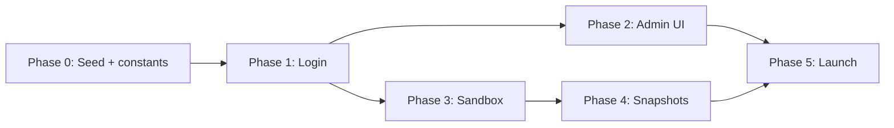

# Org-Perspective Event Demo — Multi-Phased Implementation Plan

**Status:** Phases 0–5 complete (demo tenant events sandbox live)  
**Target URL:** `https://demo.meridian.study/events-demo`  
**Scope:** A self-contained, read-only sandbox on the **demo tenant only** that lets prospects log in with auto-generated credentials, explore a realistic org event workspace across pre-event → during-event → post-event stages, and never leave the demo or mutate data.

---

## Assumptions (out of scope for eng implementation)

| Assumption | Owner |
|------------|-------|
| `demo.meridian.study` subdomain, DNS, deploy, and tenant DB (`MONGO_URI_DEMO`) | You |
| Demo tenant row in platform config (if needed) | You |
| CORS allowlist for `demo.meridian.study` in `app.js` when deploying | You |

Eng work assumes the `demo` tenant key resolves like `rpi` / `tvcog`. All demo data and credentials live **inside the demo tenant database** — no separate platform DB setup.

---

## 1. Goals & Non-Goals

### Goals

| Goal | Detail |
|------|--------|
| **Demo tenant only** | `/events-demo` routes and APIs are **hardcoded** to `tenantKey === 'demo'`; invisible on `rpi`, `tvcog`, etc. |
| **Frictionless entry** | `/events-demo` login portal; credentials auto-generated and shareable |
| **Org event perspective** | Authentic `EventDashboardFocused` experience (not a wireframe) |
| **Lifecycle exploration** | Smooth navigation across pre-event, during-event, and post-event stages |
| **Analytics visibility** | Track demo logins, phase transitions, tab views, session duration |
| **Admin control** | Admin dashboard tab on demo tenant to generate, list, revoke, and inspect demo credentials |
| **Safety** | No writes, no escape to other dashboards |

### Non-Goals (v1)

- Public self-registration on the demo tenant
- Google / SAML / MFA on demo accounts
- Mobile app demo parity
- Multi-org switching inside the demo
- Full four-state lifecycle redesign (`created` / `preparing` / `live` / `concluded`) — reuse existing `EventDashboardFocused` phases first

---

## 2. Architecture Overview

```
demo.meridian.study/events-demo          (only when req.school === 'demo')
        │
        ▼
┌───────────────────┐     POST /events-demo/auth/login
│  DemoLoginPortal  │ ─────────────────────────► demo_credentials (demo tenant DB)
└─────────┬─────────┘     analytics: demo_login_success / demo_login_failure
          │ JWT (isDemoSession + demoCredentialId + allowedRoutes)
          ▼
┌───────────────────┐     GET /events-demo/workspace?phase=planning|runOfShow|postMortem
│ DemoEventSandbox  │ ◄── phase-overridden dashboard payload from seeded event
│  (read-only shell)│
└─────────┬─────────┘
          │ phase rail: Pre-event │ During │ Post-event
          ▼
   EventDashboardFocused (wrapped)
   - readOnly prop enforced
   - navigation guard blocks external routes
   - phase override server-side (not localStorage debug panel)
```

### Key design decisions

1. **Hardcoded tenant gate** — `backend/constants/demoTenant.js` exports `DEMO_TENANT_KEY`, `DEMO_ROUTE_PREFIX`, `isDemoTenant()`. All demo routes/middleware call `assertDemoTenant(req.school)`; frontend mirrors with hostname/subdomain check.
2. **Unique route prefix** — `/events-demo` avoids collision with `/event/:eventId` (public attendee page) and `/events` (events hub).
3. **Separate demo route tree** — do not mount inside `ClubDash`; no sidebar escape hatches.
4. **Credentials in demo tenant DB** — collection `demo_credentials`; manifest in `demo_manifests` points at seeded org/event IDs.
5. **Shared operator user** — all demo credentials authenticate into one seeded operator account (`events-demo-operator@internal.meridian`) with org `manage_events`; credential ID is tracked for analytics.
6. **Phase as URL state** — `/events-demo?phase=planning` enables deep links, back/forward, and analytics per phase.
7. **Write blocking at two layers** — frontend disables mutations; backend middleware rejects non-GET for demo sessions.

### Tenant isolation (hardcoded)

```js
// backend/constants/demoTenant.js
const DEMO_TENANT_KEY = 'demo';
const DEMO_ROUTE_PREFIX = '/events-demo';

// app.js — only mount demo router when req.school === 'demo'
// App.js — only register /events-demo routes when subdomain is 'demo'
// Other tenants: 404 or redirect to / if /events-demo is hit
```

---

## 3. Phase Mapping (User-Facing ↔ Existing Code)

| Demo label | `EVENT_WORKFLOW_PHASES` | Typical tabs surfaced | Fake-data emphasis |
|------------|-------------------------|----------------------|-------------------|
| **Pre-event** | `planning` | Overview, Tasks, Agenda, Registrations, Communications | Open tasks, growing registration count, scheduled comms |
| **During event** | `runOfShow` | Overview, Check-in, Agenda (live), QR, Registrations | ~68% checked in, agenda "now" marker |
| **Post-event** | `postMortem` | Post-mortem, Analytics, Feedback, Tasks (retro) | Final attendance, retro tasks |

Reference: `EventDashboardFocused.jsx` (`inferWorkflowPhase`, `DEBUG_PHASE_OVERRIDE_STORAGE_KEY`).

---

## 4. Seed Script (done)

**Path:** `backend/scripts/seed-demo-tenant.js`  
**Run (CLI):**

```bash
cd Meridian/backend
MONGO_URI_DEMO='mongodb://...' node scripts/seed-demo-tenant.js
# replace existing seed:
MONGO_URI_DEMO='mongodb://...' node scripts/seed-demo-tenant.js --reset
```

**Run (HTTP — preferred when shell access is unavailable):**

Admin auth required. Demo tenant only (`demo.meridian.study`, or locally `X-Tenant: demo` / `?school=demo`).

```bash
# Check whether seed exists
GET /admin/demo-seed-status

# Seed (skip if manifest already exists)
POST /admin/seed-demo-tenant
Content-Type: application/json
{}

# Replace existing seed
POST /admin/seed-demo-tenant
Content-Type: application/json
{ "reset": true }
```

Response includes `previewCredential.password` only on a fresh seed (not when `alreadySeeded: true`).

**Implementation:** `backend/services/seedDemoTenantService.js` (shared by CLI + route).

**What it creates (demo tenant DB only):**

| Entity | Detail |
|--------|--------|
| **Org** | Meridian Demo Collective — 10 fake members + owner |
| **Event** | Spring Community Night — `status: approved`, dates bracketing now |
| **Registrations** | 100 fake attendees on `event.attendees`, ~68% checked in |
| **Agenda** | 8 items (setup → breakdown) |
| **Tasks** | 5 pre-event + 4 post-event |
| **Event jobs** | Check-in desk, room setup |
| **Analytics** | `EventAnalytics` with views/registrations |
| **Manifest** | `demo_manifests` key `events-demo` → `orgId`, `eventId` |
| **Preview credential** | `preview@demo.meridian.study` + one-time generated password (printed to stdout) |

**Safety:** Script refuses to run unless `school === 'demo'`.

**Supporting wiring:** `connectionsManager.js` maps `demo` → `MONGO_URI_DEMO`.

---

## 5. Implementation Phases

---

### Phase 0 — Foundation ✅

**Done in repo:**

- [x] `backend/constants/demoTenant.js` — tenant key + route prefix + guards
- [x] `backend/connectionsManager.js` — `demo: process.env.MONGO_URI_DEMO`
- [x] `backend/scripts/seed-demo-tenant.js` — curated fake data
- [x] `backend/services/seedDemoTenantService.js` + `POST /admin/seed-demo-tenant`
- [x] `frontend/src/utils/demoTenant.js` — client tenant guard
- [x] `frontend/src/config/tenantRedirect.js` — demo in `DEFAULT_TENANTS`
- [x] `frontend/src/App.js` + `Layout.jsx` — `/events-demo` route (demo tenant only)

**Remaining (ops):** run seed against live demo DB when subdomain is ready.

---

### Phase 1 — Demo Credentials & Login Portal ✅

**Done in repo:**

#### Backend
- [x] `schemas/demoCredential.js`, `schemas/demoManifest.js`
- [x] `services/demoModelService.js`, `demoCredentialService.js`, `demoEventSnapshotService.js`
- [x] `middlewares/demoSession.js`, `middlewares/blockDemoWrites.js`
- [x] `routes/demoRoutes.js` (demo tenant only)
- [x] Demo auth uses isolated `demoAccessToken` cookie (does not activate main `AuthContext`)

| Method | Path | Status |
|--------|------|--------|
| `POST` | `/events-demo/auth/login` | ✅ |
| `POST` | `/events-demo/auth/logout` | ✅ |
| `GET` | `/events-demo/auth/me` | ✅ |
| `GET` | `/events-demo/workspace?phase=` | ✅ |
| `POST` | `/admin/demo-credentials` | ✅ |
| `GET` | `/admin/demo-credentials` | ✅ |
| `PATCH` | `/admin/demo-credentials/:id` | ✅ |
| `GET` | `/admin/demo-credentials/analytics` | ✅ |

#### Frontend
- [x] `hooks/useDemoSession.js`
- [x] `pages/Demo/DemoEventLogin.jsx`
- [x] `pages/Demo/DemoEventSandbox.jsx`
- [x] `pages/Demo/DemoPhaseRail.jsx`
- [x] `pages/Demo/DemoEventsPage.jsx` (+ navigation guard)
- [x] `EventDashboardFocused` — `demoMode`, `readOnly`, `workflowPhaseOverride`, `dashboardFetchUrl`
- [x] Analytics: `demo_login_success`, `demo_login_failure`, `demo_phase_view`, `demo_escape_blocked`

**Exit criteria:** Seed demo tenant → log in at `/events-demo` with preview credential → explore phases in sandbox.

**Not in Phase 1 (Phase 2):** Admin UI tab for credential management (API is ready).

---

### Phase 2 — Admin Dashboard: Demo Credential Management ✅

**Done in repo:**

- [x] `frontend/src/pages/Admin/DemoCredentials/DemoCredentialsAdmin.jsx`
- [x] `Admin.jsx` — Demo credentials tab first on demo tenant; back navigates to `/events-demo`
- [x] Generate form (label, optional expiry) with one-time password modal
- [x] Credentials table (status, login count, last login, revoke, copy email)
- [x] Analytics summary (active credentials, logins, avg session, phase distribution)
- [x] Per-credential journey drill-down (`GET /admin/demo-credentials/:id/journey`)
- [x] Enhanced `getDemoCredentialAnalytics` (phase distribution, avg session, login failures)

**Exit criteria:** Admin generates credentials from UI; revoked credentials cannot log in.

---

### Phase 3 — Read-Only Event Sandbox Shell ✅

**Done in repo:**

#### Layout & containment
- [x] `DemoEventSandbox` — top bar, phase rail, `EventDashboardFocused`, footer banner
- [x] `DemoNavigationGuard.jsx` — blocks navigation outside `/events-demo`
- [x] `Layout.jsx` — hides global `Banner` and org-invite modal on sandbox route
- [x] Dynamic event name from manifest (`eventName` on auth/me + login)

#### Phase navigation
- [x] URL-synced `?phase=planning|runOfShow|postMortem`
- [x] Server phase override via `/events-demo/workspace?phase=`
- [x] `useDemoPhasePrefetch` — prefetch on rail hover + adjacent phases
- [x] `demo_phase_view` analytics on transitions

#### Read-only enforcement
- [x] `EventDashboardFocused` — `demoMode` / `readOnly` on tabs (agenda, tasks, editor, registrations, check-in, communications)
- [x] `verifyToken` — accepts existing `demoAccessToken` session for GET tab data
- [x] `blockDemoWrites` — rejects non-GET mutations for demo sessions (already wired)

#### Analytics
- [x] `demo_tab_view` on tab changes in demo mode
- [x] `useDemoSessionTracking` — `demo_session_end` with `durationMs` + `phasesVisited[]`
- [x] `demo_escape_blocked` on navigation guard (Phase 1)

**Exit criteria:** Phase switching works; writes inert; escape attempts blocked.

---

### Phase 4 — Phase-Specific Snapshot Layer ✅

**Done in repo:**

- [x] `demoEventSnapshotService.js` — phase shaping for tasks, agenda, attendees, analytics, registration stats
- [x] `GET /events-demo/tasks?phase=` — phase-aware task list for demo sandbox
- [x] `GET /events-demo/agenda?phase=` — phase-aware agenda with live marker metadata
- [x] Workspace `stats.tasks`, `liveAgendaItemId`, `demoPhase` surfaced to dashboard
- [x] `EventTasksTab` / `AgendaBuilder` / `EventPlanningOverviewSnapshot` use demo fetch URLs in `demoMode`
- [x] Live agenda UI (`agenda-live-banner`, `Live now` pill on list + calendar items)
- [x] Unit tests: `backend/tests/unit/demoEventSnapshotService.test.js`

| Phase | Adjustments |
|-------|-------------|
| **Pre-event** | `operationalStatus: upcoming`; 0% check-ins; ~88% registration count; open pre-event tasks |
| **During** | `operationalStatus: active`; 68% checked in; live agenda marker on Community spotlight |
| **Post-event** | `operationalStatus: completed`; 82% checked in; retro tasks in progress; final analytics |

**Exit criteria:** Walkthrough shows clearly different states per phase.

---

### Phase 5 — Launch & Operations ✅

**Done in repo:**

- [x] `Landing.jsx` hero + footer **Explore demo** → `getDemoEventsPortalUrl()` (`https://demo.meridian.study/events-demo` in production)
- [x] Sales playbook in `DemoCredentialsAdmin.jsx` + `DEMO_EVENTS_OPS_RUNBOOK.md`
- [x] Rate limiting — 5 login attempts / 15 min per IP (`demoCredentialService.js`)
- [x] `expireDemoCredentials()` + hourly cron (`jobs/demoTenantJobs.js`, `DISABLE_DEMO_CRON`)
- [x] `POST /admin/demo-credentials/expire-stale` + `scripts/expire-demo-credentials.js`
- [x] Re-seed runbook in `DEMO_EVENTS_OPS_RUNBOOK.md`; npm scripts `seed:demo-tenant`, `expire:demo-credentials`

| Task | Detail |
|------|--------|
| Landing CTA | `Landing.jsx` → `https://demo.meridian.study/events-demo` |
| Sales playbook | One credential per prospect with label |
| Rate limiting | 5 login attempts / 15 min per IP |
| Credential expiry cron | Invalidate past `expiresAt` |
| Re-seed runbook | `node scripts/seed-demo-tenant.js --reset` |

---

## 6. File & Module Checklist

### Done (Phases 0–5)

```
Meridian/backend/constants/demoTenant.js
Meridian/backend/connectionsManager.js          (demo → MONGO_URI_DEMO)
Meridian/backend/services/seedDemoTenantService.js
Meridian/backend/scripts/seed-demo-tenant.js
Meridian/backend/scripts/expire-demo-credentials.js
Meridian/backend/jobs/demoTenantJobs.js
Meridian/backend/routes/adminRoutes.js          (GET /admin/demo-seed-status, POST /admin/seed-demo-tenant)
Meridian/backend/routes/demoRoutes.js
Meridian/backend/middlewares/demoSession.js
Meridian/backend/middlewares/blockDemoWrites.js
Meridian/backend/middlewares/demoBootstrapAccess.js
Meridian/backend/services/demoCredentialService.js
Meridian/backend/services/demoEventSnapshotService.js
Meridian/backend/schemas/demoCredential.js
Meridian/frontend/src/pages/Demo/DemoEventLogin.jsx
Meridian/frontend/src/pages/Demo/DemoEventSandbox.jsx
Meridian/frontend/src/pages/Demo/DemoPhaseRail.jsx
Meridian/frontend/src/pages/Demo/DemoNavigationGuard.jsx
Meridian/frontend/src/pages/Admin/DemoCredentials/DemoCredentialsAdmin.jsx
Meridian/frontend/src/hooks/useDemoSession.js
Meridian/frontend/src/hooks/useDemoPhasePrefetch.js
Meridian/frontend/src/hooks/useDemoSessionTracking.js
Meridian/frontend/src/utils/demoTenant.js
Meridian/docs/DEMO_EVENTS_OPS_RUNBOOK.md
```

### To modify (as needed)

```
Meridian/frontend/src/App.js                      — /events-demo routes (demo tenant only)
Meridian/frontend/src/AuthContext.js              — demo session handling
Meridian/backend/app.js                           — conditional demo router mount
Meridian/frontend/src/pages/Admin/Admin.jsx       — Demo Credentials tab (demo only)
Meridian/frontend/src/pages/ClubDash/.../EventDashboardFocused.jsx — readOnly prop
Meridian/frontend/src/pages/Landing/Landing.jsx   — CTA link
```

---

## 7. Security Considerations

| Risk | Mitigation |
|------|------------|
| Demo routes on wrong tenant | Hardcoded `isDemoTenant` gate in frontend + backend |
| Credential leakage | Expiry, revoke, rate limit; fictional data only |
| Write escape | `blockDemoWrites` + integration tests |
| Analytics PII | `credentialId` only in event properties |
| Cross-tenant credential reuse | Credentials collection exists only in demo DB |

---

## 8. Rollout Order



**MVP slice:** Phase 0 (done) + Phase 1 + Phase 3 with seeded preview credential.

---

## 9. Open Questions

1. **Drafting sub-phase** — part of "Pre-event" or omit?
2. **PDF export in post-event** — allow preview download or block?
3. **Feedback tab** — add synthetic `FormResponse` seed in a follow-up?
4. **Admin on demo tenant** — limit `/admin` to Demo Credentials tab only, or full admin access for Meridian staff?

---

## 10. Success Metrics

| Metric | Target (90 days) |
|--------|------------------|
| Login → 2+ phases viewed | > 80% |
| Avg session duration | > 4 min |
| Credential usage rate | > 70% used once |
| Successful write escapes | 0 |

---

## Appendix A — Reusable Patterns

| Pattern | Location |
|---------|----------|
| Workflow phases | `EventDashboardFocused.jsx` |
| Dev phase override | `DEBUG_PHASE_OVERRIDE_STORAGE_KEY` → replace with server override |
| Registrations read-only | `RegistrationsTab.jsx` |
| Admin event operator | `AdminEventOperatorPage.jsx` |
| Analytics SDK | `services/analytics/analytics.js` |
| Migration/seed style | `migrations/seedDomainSpaceGovernance.js` |

## Appendix B — Related Specs

- `frontend/design/EventDashboard/Meridian/EventDashboard Spec.md`
- `EVENT_SYSTEM_SPECIFICATION.md`
- `frontend/EVENTS_MANAGEMENT_ANALYSIS.md`
